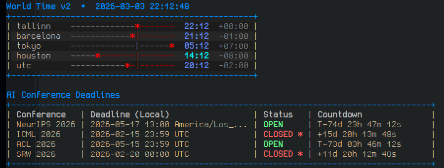

# World Clock + AI Deadlines

Terminal tools for:
- world time timeline (`worldclock.sh`)
- AI conference deadline tracker (`deadline` command)

## Preview



## Platform Support

Fully supported:
- Linux
- macOS

## Requirements

- Bash
- `tput`
- `curl` (for `deadline add-auto`)
- `date` with timezone support

Linux:
- Usually preinstalled.

macOS:
- Built-in `date` is supported.
- Recommended for best date parsing compatibility:

```bash
brew install coreutils
```

This provides `gdate`, which the script uses automatically when available.

## 1) World Clock

Run:

```bash
bash worldclock.sh
```

One-shot:

```bash
INTERVAL=0 bash worldclock.sh
```

Screenshot:

```text
World Time  •  2026-03-03 15:51:50
+-------------------------------------------------+
| tallinn    -------------*-------  15:51  +00:00 |
| barcelona  ------------*|-------  14:51  -01:00 |
| tokyo      -------------|------*  22:51  +07:00 |
| houston    -----*-------|-------  07:51  -08:00 |
| utc        -----------*-|-------  13:51  -02:00 |
+-------------------------------------------------+
```

## 2) Install `deadline` Command (once)

From project directory:

```bash
chmod +x deadline ai_deadlines.sh
mkdir -p ~/.local/bin
ln -sf "$PWD/deadline" ~/.local/bin/deadline
```

Linux (bash):

```bash
echo 'export PATH="$HOME/.local/bin:$PATH"' >> ~/.bashrc
source ~/.bashrc
hash -r
```

macOS (zsh default):

```bash
echo 'export PATH="$HOME/.local/bin:$PATH"' >> ~/.zshrc
source ~/.zshrc
hash -r
```

macOS (if using bash):

```bash
echo 'export PATH="$HOME/.local/bin:$PATH"' >> ~/.bash_profile
source ~/.bash_profile
hash -r
```

Verify:

```bash
deadline help
```

## 3) Use `deadline`

Run tracker:

```bash
deadline
```

Interactive commands:

```bash
deadline add
deadline add-row
deadline add-auto
deadline remove
deadline list
```

One-shot:

```bash
INTERVAL=0 deadline run
```

Show website column:

```bash
SHOW_WEBSITE=1 deadline run
```

Screenshot:

```text
AI Deadlines ●  •  Your Time: 2026-03-03 20:21:14 EET
+--------------------------------------------------------------------------------------------------+
| Conference   | Abstract (Your Time)  | Deadline (Your Time)  | Status     | Countdown            |
| NeurIPS 2026 | 2026-05-10 23:00 EEST | 2026-05-17 23:00 EEST | OPEN/A     | T-68d 01h 38m 46s    |
| ICML 2026    | 2026-01-30 01:59 EET  | 2026-02-16 01:59 EET  | CLOSED *   | +15d 18h 22m 14s     |
| ACL 2026     | 2026-05-02 02:59 EEST | 2026-05-16 02:59 EEST | OPEN/A     | T-59d 05h 37m 46s    |
| SRW 2026     | 2026-02-04 02:00 EET  | 2026-02-20 02:00 EET  | CLOSED *   | +11d 18h 21m 14s     |
+--------------------------------------------------------------------------------------------------+
Ctrl+C to quit • deadline add-row/add/add-auto/list/remove • INTERVAL=0 for one-shot
```

## Advanced Commands

Manual add:

```bash
deadline add -n "NeurIPS 2026" -s "Abstract" -d "2026-05-10 13:00" -z "America/Los_Angeles" -w "https://neurips.cc"
```

One-row add (recommended):

```bash
deadline add-row -n "NeurIPS 2026" -a "2026-05-10 13:00" -d "2026-05-17 13:00" -z "America/Los_Angeles" -w "https://neurips.cc"
```

Auto-fetch from website (best effort):

```bash
deadline add-auto -n "ICLR 2027" -s "Abstract" -u "https://iclr.cc/Conferences/2027/CallForPapers" -z "UTC"
```

Remove:

```bash
deadline remove --id 3
deadline remove -n "NeurIPS 2026" -s "Abstract"
```

## `deadlines.txt` format (one row per conference)

```text
Conference Name|Abstract Date|Deadline Date|IANA_Timezone|Website
```

Example:

```text
NeurIPS 2026|2026-05-10 13:00|2026-05-17 13:00|America/Los_Angeles|https://neurips.cc
ICML 2026|2026-01-29 23:59|2026-02-15 23:59|UTC|https://icml.cc
```
